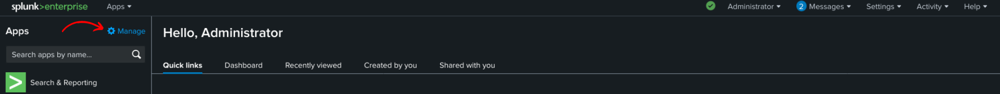
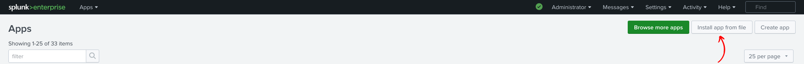
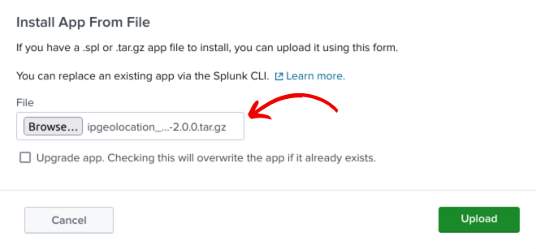
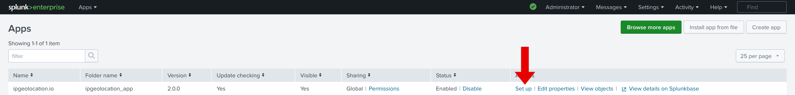
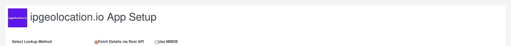
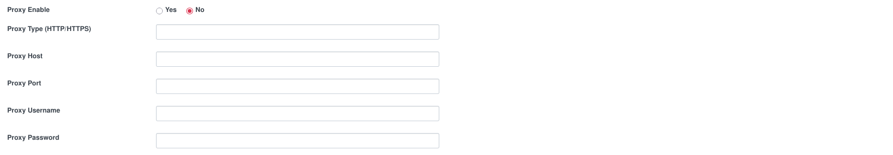
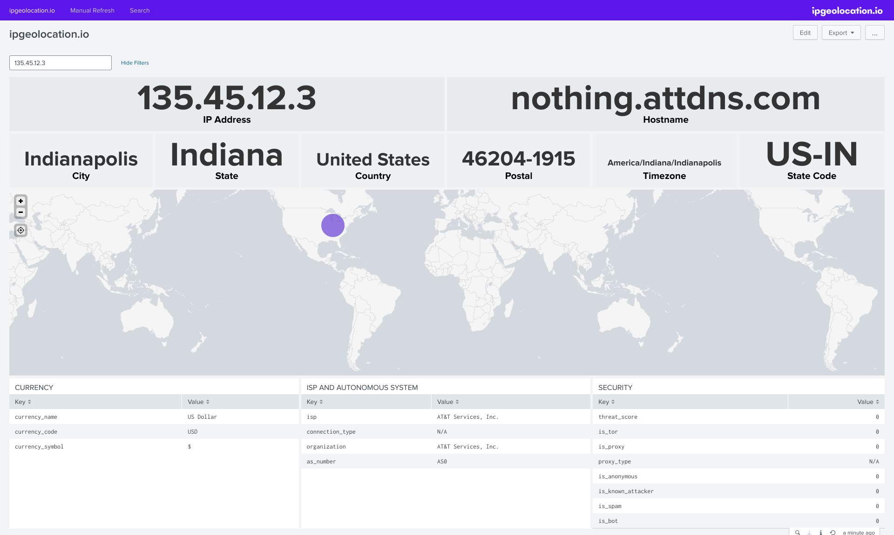
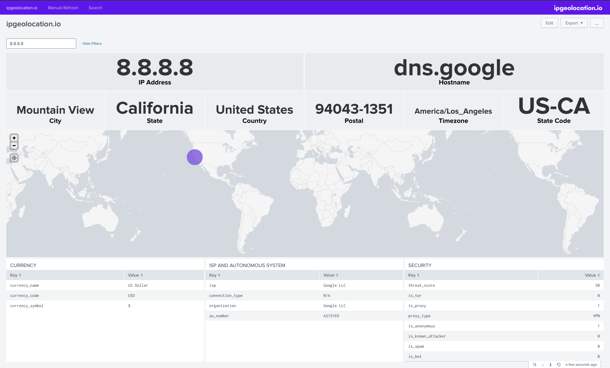
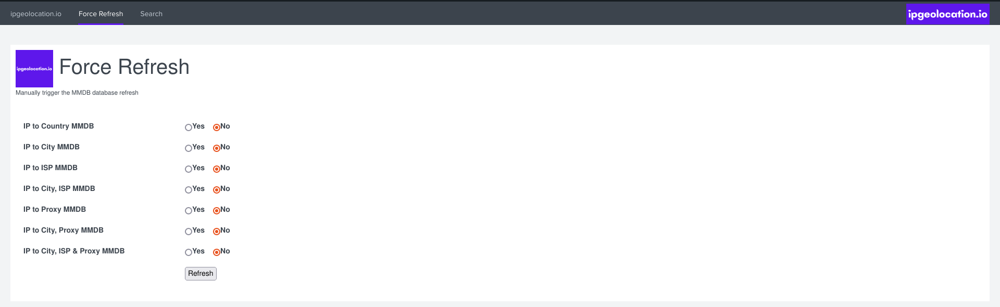

# ipgeolocation.io Splunk App Installation & Configuration

**App Version**: 3.0.1 (see [CHANGELOG](./CHANGELOG.md))

**Author**: ipgeolocation.io

**Description**: Installation and Configuration Document for ipgeolocation.io App for Splunk

**Latest Update Date**: November 10, 2025

## Supported Operating Systems

All Splunk supported Operating Systems (Windows, Linux, Mac)

Ref: [https://www.splunk.com/en_us/download/splunk-enterprise.html](https://www.splunk.com/en_us/download/splunk-enterprise.html)

## Supported Splunk Version

| Splunk |
| --- |
| Splunk 9.0 |
| Splunk 9.1 |
| Splunk 9.2 |
| Splunk 9.3 |
| Splunk 9.4 |
| Splunk 10.0 |
| Splunk 10.1 |

## Introduction

The ipgeolocation.io App for Splunk integrates ipgeolocation.io's API & Database products into Splunk. This app adds 4 commands to the Splunk:
- `ipgeolocation`
- `ipgeolocationbatch`
- `ipsecurity`
- `ipsecuritybatch`

The above commands lookup IP to location, hostname, network, autonomous system (AS), security, and timezone information from ipgeolocation.io API or database as configured.

## Pre-requisites

You need to sign up at [ipgeolocation.io](https://app.ipgeolocation.io/signup) and buy an API or a Database subscription to use ipgeolocation.io App for Splunk. The app won't work with free API subscription.

## Installation

**NOTE**: There are multiple ways of deploying apps to Splunk environment and in this document, we’ll be referring installation via CLI (Command Line Interface).

### Case 1: Single Stand Alone Splunk Installation (CLI)

Single standalone Splunk Enterprise Installation on Windows/*NIX

1. **Unzip ipgeolocation_app.tar.gz**
2. **Copy** the unzipped directory **ipgeolocation_app** to **$SPLUNK_HOME/etc/apps/**
3. **Open CLI** and restart Splunk using **./splunk restart**

### Case 2: Distributed Architecture

Single Indexer Single Search Head and Single Forwarder (Heavy or Universal) and Deployment server

1. **Unzip ipgeolocation_app.tar.gz**
2. **Copy** the unzipped directory **ipgeolocation_app** to deployment server in the following location
    
    **$SPLUNK_HOME/etc/deployment-apps/**
    
3. Add following to **serverclass.conf**
    
    ```
    [serverClass:<SEARCHHEAD_SERVERCLASS>:app:< ipgeolocation_app >]
    stateOnClient=enabled
    restartSplunkd=true
    ```
    
4. **Open CLI** and deploy the apps using following command: **./splunk reload deploy-server**

### Case 3: Distributed Architecture

Multiple non-clustered Indexers, Multiple non-clustered Search Heads, Forwarder (Heavy or Universal) and Deployment server

1. **Unzip ipgeolocation_app.tar.gz**
2. **Copy** the unzipped directory **ipgeolocation_app** to deployment server in the following location **$SPLUNK_HOME/etc/deployment-apps/**
3. Add following to **serverclass.conf**

    ```
    [serverClass:<SEARCHHEAD_SERVERCLASS>:app:< ipgeolocation_app >]
    stateOnClient=enabled
    restartSplunkd=true
    ```

4. **Open CLI** and deploy the apps using following command: **./splunk reload deploy-server**

### Case 4: Distributed Architecture

Single Site Clustered Indexer, Clustered Search Heads and Forwarder (Heavy or Universal).

1. **Unzip ipgeolocation_app.tar.gz**
2. **Copy** **ipgeolocation_app** to Deployer server in the following location **$SPLUNK_HOME/etc/shcluster/apps/**
3. **Open CLI** on Deployer and deploy the app on Search Head Cluster using following command
    
    ```
    ./splunk apply shcluster-bundle -target <URI>:<management_port> -auth <username>:<password>
    ```
    
### Case 5: Standalone Installation (WEB)

1. On the Splunk Home Page, Click on “Manage”
    

    
2. On the Manage Apps page, Click on “Install app from file”
    

    
3. Select path for ipgeolocation.io Splunk app .tar.gz file and Click “Upload”
    

    
4. It is a good practice to restart the Splunk, please restart

## Configuration

1. After installation and restart, login to the Splunk web.
2. Go to 'Manage' under Apps in the left bar.
2. It will list out all the installed applications and the options to configure these apps.
3. Look for 'ipgeolocation.io' and click on the 'Set up' link to configure the app.
4. Make Sure to restart Splunk Instance after setting up the app. In case of a Search Head Cluster, each search head needs to be restarted or a rolling restart must be initiated to make all changes work properly.




### API Configuration

Select _Fetch Details via Rest API_ in the Lookup Method to use your API subscription in the ipgeolocation.io App for Splunk, provide the API Key for your API subscription in the **Key for API Subscription**, and select the plan for your API subscription. These are only 3 inputs required to use ipgeolocation.io API with Splunk.



Rest of the fields are optional in case of using the API. However, to access ipgeolocation.io API through a proxy, you can select _Yes_ against **Enable Proxy** and provide proxy settings.

Here are the required proxy configuration details:



Finally, click **Submit**.

### MMDB Configuration

Select _Use MMDB_ option in the Lookup Method to use your database subscription on ipgeolocation.io with Splunk.

You have the following choices to setup the app for ipgeolocation.io databases:

#### Download MMDB on each Search Head (Used for Search Head Cluster Only)

If you've a search head cluster deployed:

- select "**No**" if you want to download MMDB from ipgeolocation.io on only one Search Head and sync on other search heads.
- select "**Yes**" (default one) to let each Search Head download it's MMDB copy from ipgeolocation.io.

Syncing will be a bit slow as compared to separate download as it has to copy MMDBs to all search heads.

#### Replicate MMDB on Indexers

Select "**Yes**" against "**Replicate MMDB on Indexers**" to enable replication on MMDB bundle. This will also make a bunch of changes in the code that will enable *ipgeolocation* & *ipsecurity* to work in streaming mode. This is expected to cause performance boost on the query at the expense of increase in bundle size. This setting is applicable if you're using ipgeolocation.io app on splunk search head cluster and you have indexer cluster.

#### MMDB Subscription Credentials

Following ipgeolocation.io databases are supported in the ipgeolocation.io App for Splunk:

| Database Tier | Name |
| ------------- | ---- |
| Standard | IP to Country |
| Standard | IP to Location |
| Standard | IP to ISP |
| Standard | IP to City & ISP |
| Advance | IP to Location |
| Advance | IP Abuse Contact |
| Advance | IP to ASN |
| Advance | IP to ASN (Extended) |
| Advance | IP to Company |
| Advance | IP WHOIS |
| Advance | IP Location, Company & ASN |
| Advance | IP to ASN & Company |
| Security Pro | IP Security |
| Security Pro | IP Residential Proxy |
| Security Pro | IP Hosting Provider |
| Security Pro | IP to Security & Location |
| Security Pro | IP to Security, Location & ISP |

It is possible to subscribe more than one databases on ipgeolocation.io. So, the app needs you to enable each of your subscribed databases and provide API key and update interval for each database subscription.

For your subscribed database plans on ipgeolocation.io, provide the following configuration to enable the ipgeolocation.io app for MMDB lookup.

##### **Enable**

Select "**Yes**" against *Enable* buttons to enable MMDB lookup from it.

##### **Key**

Provide the database subscription's API key in the *Key* box to authenticate database downloads.

##### **Update Interval**

Also select 'Weekly' or 'Daily' button *update interval* so that the app can correctly download database updates at right interval.

That's all you need to configure MMDB lookups.

## Proxy Setting

All the proxy related fields are optional as explained above.


    
**NOTE**: MMDB is downloaded in `lookups` directory in **$SPLUNK_HOME/etc/apps/ipgeolocation_app** directory. And it does not overwrite the Splunk’s default MMDB.

## Usage

ipgeolocation.io App for Splunk adds 4 commands to the Splunk: `ipgeolocation`, `ipgeolocationbatch`, `ipsecurity` and `ipsecuritybatch`.

Use `ipsecurity` and `ipsecuritybatch` commands only if you're subscribed to **Security Pro** API Plan. And for the rest of API and database subscriptions, use `ipgeolocation` and `ipgeolocationbatch` commands.

Here are the detailed information on using these commands:

### `ipgeolocation` Command

`ipgeolocation` is a streaming command. You can use it to lookup IP to location (city level), country, hostname, abuse contact, network, time zone and security information that your subscription on ipgeolocation.io provides.

Here is an example of using `ipgeolocation` command:

```bash
| makeresults 1 | eval IP="1.1.1.1" | ipgeolocation IP
```

In the above example, `ipgeolocation` takes IP address as input from the output of `eval` command and looks it up from ipgeolocation.io API or the database.

#### Optional Flags

`ipgeolocation` looks up IP to location information by default and it accepts the following optional flags to lookup more information along with IP to location data.

| Flag | Type | Default Value | Accepted Values | Description |
|------|------|---------------|-----------------|-------------|
| `liveHostname` | `boolean` | `false` | `true`, `false` | Lookup live hostname for the IP address. Supported on lookup from ipgeolocation.io API only. |
| `hostnameFallbackLive` | `boolean` | `false` | `true`, `false` | Lookup hostname for the IP address from database and fallback to live lookup if not in the database. Supported on lookup from ipgeolocation.io API only. |
| `abuseContact` | `boolean` | `false` | `true`, `false` | Lookup abuse contact details for an IP address. |
| `dma` | `boolean` | `false` | `true`, `false` | Lookup DMA (Designated Market Area) Code for the location of IP address. |
| `security` | `boolean` | `false` | `true`, `false` | Lookup security information for an IP address. |
| `timezone` | `boolean` | `false` | `true`, `false` | Lookup time zone details for the location of IP address. |
| `allinfo` | `boolean` | `false` | `true`, `false` | Lookup abuse contact, DMA (Designated Market Area) code, security and time zone details for the provided IP address. |
| `prefix` | `boolean` | `false` | `true`, `false` | Prefix query name to all fields in the response. |
| `language` | `string` | `en` | `en`, `de`, `ru`, `ja`, `fr`, `cn`, `es`, `cs`, `it`, `ko`, `fa`, `pt` | Set the response language for search results. |

Set the proper flag on `ipgeolocation` command to search relevant information from ipgeolocation.io API or the database.

### `ipgeolocationbatch` Command

`ipgeolocationbatch` is a generative command. This command takes in a comma-separated list of IP addresses to lookup IP to location, security, hostname, abuse contact, DMA and time zone information in bulk.

Here is an example to search IP data using `ipgeolocationbatch` command:

```bash
| ipgeolocationbatch ips="1.0.0.1,45.22.33.67,101.34.77.4"
```

In this example, `ipgeolocationbatch` command looks up IP to location for `1.0.0.1`, `45.22.33.67`, and `101.34.77.4` IP addresses.

#### Optional Flags

`ipgeolocationbatch` command searches IP to location information by default. It accepts following flags to query more information:

| Flag | Type | Default Value | Accepted Values | Description |
|------|------|---------------|-----------------|-------------|
| `ips` | `string` | `''` | `string` | Provide a list of up to 50,000 IP addresses, joined with a comma as a string. It must be provided. |
| `liveHostname` | `boolean` | `false` | `true`, `false` | Lookup live hostname for the IP address. Supported on lookup from ipgeolocation.io API only. |
| `hostnameFallbackLive` | `boolean` | `false` | `true`, `false` | Lookup hostname for the IP address from database and fallback to live lookup if not in the database. Supported on lookup from ipgeolocation.io API only. |
| `abuseContact` | `boolean` | `false` | `true`, `false` | Lookup abuse contact details for an IP address. |
| `dma` | `boolean` | `false` | `true`, `false` | Lookup DMA (Designated Market Area) Code for the location of IP address. |
| `security` | `boolean` | `false` | `true`, `false` | Lookup security information for an IP address. |
| `timezone` | `boolean` | `false` | `true`, `false` | Lookup time zone details for the location of IP address. |
| `language` | `string` | `en` | `en`, `de`, `ru`, `ja`, `fr`, `cn`, `es`, `cs`, `it`, `ko`, `fa`, `pt` | Set the response language for search results. |
| `allinfo` | `boolean` | `false` | `true`, `false` | Lookup abuse contact, DMA (Designated Market Area) code, security and time zone details for the provided IP address. |

Set any of the above flags on `ipgeolocationbatch` command to query required information.

### `ipsecurity` Command

`ipsecurity` is a streaming command. It looks up IP to security data from ipgeolocation.io API for given IP addresses. Here is an example to use this command:

```bash
| makeresults 1 | eval IP="1.1.1.1" | ipsecurity IP
```

Above example looks up IP to security, location, hostname, and all information using ipsecurity command for 1.1.1.1 IP address.

#### Optional Flags
 
`ipsecurity` command returns IP to security information by default. And, you can set the following flags to fetch more information along with IP to security details.

| Flag | Type | Default Value | Accepted Values | Description |
|------|------|---------------|-----------------|-------------|
| `liveHostname` | `boolean` | `false` | `true`, `false` | Lookup live hostname for the IP address. Supported on lookup from ipgeolocation.io API only. |
| `hostnameFallbackLive` | `boolean` | `false` | `true`, `false` | Lookup hostname for the IP address from database and fallback to live lookup if not in the database. Supported on lookup from ipgeolocation.io API only. |
| `location` | `boolean` | `false` | `true`, `false` | Lookup location information for an IP address. |
| `countryMetadata` | `boolean` | `false` | `true`, `false` | Lookup country metadata for the location of IP address. |
| `network` | `boolean` | `false` | `true`, `false` | Lookup network information for an IP address. |
| `currency` | `boolean` | `false` | `true`, `false` | Lookup local currency information for the location of IP address. |
| `timezone` | `boolean` | `false` | `true`, `false` | Lookup time zone details for the location of IP address. |
| `allinfo` | `boolean` | `false` | `true`, `false` | Lookup abuse contact, DMA (Designated Market Area) code, security and time zone details for the provided IP address. |
| `prefix` | `boolean` | `false` | `true`, `false` | Prefix query name to all fields in the response. |
| `language` | `string` | `en` | `en`, `de`, `ru`, `ja`, `fr`, `cn`, `es`, `cs`, `it`, `ko`, `fa`, `pt` | Set the response language for search results. |


### `ipsecuritybatch` Command

`ipsecuritybatch` command is a generative command to search IP to security, hostname, location and network information in bulk. Here is an example to use `ipsecuritybatch` command:

```bash
| ipsecuritybatch ips="1.0.0.1,45.22.33.67,101.34.77.4"
```

`ipsecuritybatch` command searches for IP to security information by default. You can set following flags to query more information along with it.

#### Optional Flags

| Flag | Type | Default Value | Accepted Values | Description |
|------|------|---------------|-----------------|-------------|
| `ips` | `string` | `''` | `string` | Provide a list of up to 50,000 IP addresses, joined with a comma as a string. It must be provided. |
| `liveHostname` | `boolean` | `false` | `true`, `false` | Lookup live hostname for the IP address. Supported on lookup from ipgeolocation.io API only. |
| `hostnameFallbackLive` | `boolean` | `false` | `true`, `false` | Lookup hostname for the IP address from database and fallback to live lookup if not in the database. Supported on lookup from ipgeolocation.io API only. |
| `location` | `boolean` | `false` | `true`, `false` | Lookup location information for an IP address. |
| `countryMetadata` | `boolean` | `false` | `true`, `false` | Lookup country metadata for the location of IP address. |
| `network` | `boolean` | `false` | `true`, `false` | Lookup network information for an IP address. |
| `currency` | `boolean` | `false` | `true`, `false` | Lookup local currency information for the location of IP address. |
| `timezone` | `boolean` | `false` | `true`, `false` | Lookup time zone details for the location of IP address. |
| `allinfo` | `boolean` | `false` | `true`, `false` | Lookup abuse contact, DMA (Designated Market Area) code, security and time zone details for the provided IP address. |
| `language` | `string` | `en` | `en`, `de`, `ru`, `ja`, `fr`, `cn`, `es`, `cs`, `it`, `ko`, `fa`, `pt` | Set the response language for search results. |


## Examples

**NOTE**: You can add two or more flags in single search query.

```
| makeresults 1 
| eval IP1=random()%192, IP2=random()%210, IP3=random()%230, IP4=random()%192, IP='IP1'.".".'IP2'.".".'IP3'.".".'IP4'
| table _time IP 
| ipgeolocation IP
```

### `ipgeolocation`

```
| makeresults count=2000
| eval IP1=random()%192, IP2=random()%210, IP3=random()%230, IP4=random()%192, IP='IP1'.".".'IP2'.".".'IP3'.".".'IP4'
| table _time IP
| ipgeolocation IP
```

### `ipgeolocation` (Multi)

```
| makeresults count=100
| eval IP1=random()%192, IP2=random()%210, IP3=random()%230, IP4=random()%192, SRCIP='IP1'.".".'IP2'.".".'IP3'.".".'IP4'
| eval IP1=random()%192, IP2=random()%210, IP3=random()%230, IP4=random()%192, DESTIP='IP1'.".".'IP2'.".".'IP3'.".".'IP4'
| table _time SRCIP DESTIP
| ipgeolocation SRCIP DESTIP
```

### `ipgeolocation` (prefix)

```
| makeresults count=100
| eval IP1=random()%192, IP2=random()%210, IP3=random()%230, IP4=random()%192, SRCIP='IP1'.".".'IP2'.".".'IP3'.".".'IP4'
| table _time SRCIP
| ipgeolocation prefix=true SRCIP
```

### `ipgeolocation` (security)

```
| makeresults 
| eval IP="8.8.8.8"
| ipgeolocation IP security=true
```

### `ipgeolocation` (liveHostname)

```
| makeresults 
| eval IP="8.8.8.8"
| ipgeolocation IP liveHostname=true
```

### `ipgeolocation` (hostnameFallbackLive)

```
| makeresults 
| eval IP="8.8.8.8"
| ipgeolocation IP hostnameFallbackLive=true
```

### `ipgeolocation` (allinfo)

```
| makeresults 
| eval IP="1.0.178.0"
| ipgeolocation IP allinfo=true
```

### `ipgeolocationbatch` (5 IP addresses, allinfo)

```
| ipgeolocationbatch ips="23.87.43.1,87.49.22.1,191.69.47.0,88.0.7.33,201.52.77.99" allinfo=true
```

Similarly, you can use `ipsecurity` and `ipsecuritybatch` commands and set flags on them as you need to.

## Dashboard

**Note:** Dashboard preview of ip-geolocation data won't work if the _Security Pro_ API plan is set as lookup method for now.

### ipgeolocation.io App Dashboard View





### Refresh Dashboard View

- To force refresh MMDB file at the moment.

