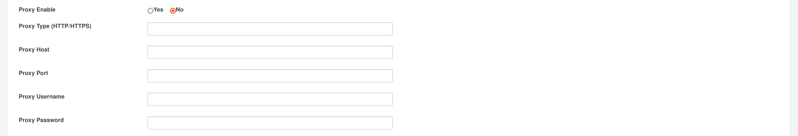

# ipgeolocation.io Splunk App Installation & Configuration

**App Version**: 2.0.0 (see [CHANGELOG](./CHANGELOG.md))

**Author**: ipgeolocation.io

**Description**: Installation and Configuration Document for ipgeolocation.io App for Splunk

**Latest Update Date**: June 5, 2024

# Supported Operating Systems

All Splunk supported Operating Systems (Windows, Linux, Mac)

Ref: [https://www.splunk.com/en_us/download/splunk-enterprise.html](https://www.splunk.com/en_us/download/splunk-enterprise.html)

# Supported Splunk Version

| Splunk |
| --- |
| Splunk 9.0.X |
| Splunk 9.1.X |
| Splunk 9.2.x |

# Introduction

The ipgeolocation.io App provides an integration between ipgeolocation.io's API & Database products and Splunk. This app adds the `ipgeolocation` and `ipgeolocationbatch` commands to Splunk, which uses ipgeolocation.io data via the API or Databases to lookup IP information for a given IP address.

# Pre-requisites

You need to sign up for an account on [ipgeolocation.io](https://app.ipgeolocation.io/signup) and buy an API or a Database subscription to use ipgeolocation.io App. App won't work with a free subscription.

# Installation

**NOTE**: There are multiple ways of deploying apps to Splunk environment, in this document we’ll be referring installation via CLI (Command Line Interface).

## Case 1: Single Stand Alone Splunk Installation (CLI)

Single standalone Splunk Enterprise Installation on Windows/*NIX

1. **Unzip ipgeolocation_app.tar.gz**
2. **Copy** the unzipped directory **ipgeolocation_app** to **$SPLUNK_HOME/etc/apps/**
3. **Open CLI** and restart Splunk using **./splunk restart**

## Case 2: Distributed Architecture

Single Indexer Single Search Head and Single Forwarder (Heavy or Universal) and Deployment server

1. **Unzip ipgeolocation_app.tar.gz**
2. **Copy** the unzipped directory **ipgeolocation_app** to deployment server in the following location
    
    **$SPLUNK_HOME/etc/deployment-apps/**
    
3. Add following to **serverclass.conf**
    
    ```
    [serverClass:<SEARCHHEAD_SERVERCLASS>:app:< ipgeolocation_app >]
    stateOnClient=enabled
    restartSplunkd=true
    ```
    
4. **Open CLI** and deploy the apps using following command: **./splunk reload deploy-server**

## Case 3: Distributed Architecture

Multiple non-clustered Indexers, Multiple non-clustered Search Heads, Forwarder (Heavy or Universal) and Deployment server

1. **Unzip ipgeolocation_app.tar.gz**
2. **Copy** the unzipped directory **ipgeolocation_app** to deployment server in the following location **$SPLUNK_HOME/etc/deployment-apps/**
3. Add following to **serverclass.conf**

    ```
    [serverClass:<SEARCHHEAD_SERVERCLASS>:app:< ipgeolocation_app >]
    stateOnClient=enabled
    restartSplunkd=true
    ```

4. **Open CLI** and deploy the apps using following command: **./splunk reload deploy-server**

## Case 4: Distributed Architecture

Single Site Clustered Indexer, Clustered Search Heads and Forwarder (Heavy or Universal).

1. **Unzip ipgeolocation_app.tar.gz**
2. **Copy** **ipgeolocation_app** to Deployer server in the following location **$SPLUNK_HOME/etc/shcluster/apps/**
3. **Open CLI** on Deployer and deploy the app on Search Head Cluster using following command
    
    ```
    ./splunk apply shcluster-bundle -target <URI>:<management_port> -auth <username>:<password>
    ```
    
## Case 5: Standalone Installation (WEB)

1. On the Splunk Home Page, Click on “Manage”
    

    
2. On the Manage Apps page, Click on “Install app from file”
    

    
3. Select path for ipgeolocation.io Splunk app .tar.gz file and Click “Upload”
    

    
4. It is good practice to restart the Splunk, please restart

# Configuration

1. After Installation and restart, login to the Splunk web and go to ‘Manage’
2. It will list out all the installed applications and their configuration option.
3. Look for 'ipgeolocation.io' and click on the 'Set up' link to configure the app.
4. Make Sure to restart Splunk Instance after setting up the app. In the case of the Search Head Cluster, each search head needs to be restarted or a rolling restart must be initiated to make all changes work properly.


## API Configuration

When selecting `Fetch Details via Rest API`, API Key field is required as it serves the purpose of authentication for accessing ipgeolocation.io API. Rest of the fields are optional, in case of using the API. However, to access ipgeolocation.io API through a proxy, you can select 'Yes' against 'Enable Proxy' and provide proxy settings. Finally, click 'Submit'.


Here is the required proxy configuration details:



## MMDB Configuration

When selecting the `Use MMDB` option, the API key field is also mandatory here.

- Setting "**Download MMDB on each Search Head**" as "**No**" is used when there is a search head cluster and you want to download MMDB from ipgeolocation.io on only one Search Head and sync on other search heads. And setting "**Yes**" is used when each Search Head is required to Download MMDB from ipgeolocation.io. Syncing will be a bit slow as compared to separate download as it has to copy MMDBs to all search heads.

- Setting "**Replicate MMDB on Indexers**" as **Yes** will enable replication on MMDB bundle and also make bunch of changes in the code that will enable *ipgeolocation* to work in streaming mode. This is expected to cause performance boost on the query at the expense on increase in bundle size. This setting is applicable if you're using ipgeolocation.io app on splunk search head cluster and you have indexer cluster.

- **Proxy Setting:** All Proxy related fields will be optional fields as explained above.


    
**NOTE**: MMDB is downloaded in `lookups` directory in **$SPLUNK_HOME/etc/apps/ipgeolocation_app** directory. And does not overwrite splunk’s default MMDB.

# Usage

## Fields

| Data Type | Lookup Method | Responded Fields |
| --------- | ------------- | ---------------- |
| Location  | `API`           | ip, continent_code, continent_name, country_code2, country_code3, country_name, country_name_official, country_capital, state_prov, state_code, district, city, zip_code, latitude, longitude, is_eu, calling_code, country_tld, languages, geoname_id, isp, connection_type, organization, as_number, currency_code, currency_name, currency_symbol, time_zone |
| Security  | `API`           | threat_score, is_tor, is_proxy, proxy_type, is_anonymous, is_known_attacker, is_spam, is_bot, is_cloud_provider |
| Hostname  | `API`           | hostname |
| Location  | `IP to Country MMDB` | ip, continent_code, continent_name, country_code2, country_code3, country_name, country_capital, calling_code, country_tld, languages, currency_code, currency_name, currency_symbol |
| Location  | `IP to City MMDB` | ip, continent_code, continent_name, country_code2, country_code3, country_name, country_capital, state_prov, state_code, district, city, zip_code, latitude, longitude, calling_code, country_tld, languages, geoname_id, currency_code, currency_name, currency_symbol, time_zone |
| Location  | `IP to ISP MMDB` | ip, continent_code, continent_name, country_code2, country_code3, country_name, country_capital, calling_code, country_tld, languages, isp, connection_type, organization, as_number, currency_code, currency_name, currency_symbol |
| Location  | `IP to City & ISP MMDB` | ip, continent_code, continent_name, country_code2, country_code3, country_name, country_capital, state_prov, state_code, district, city, zip_code, latitude, longitude, calling_code, country_tld, languages, geoname_id, isp, connection_type, organization, as_number, currency_code, currency_name, currency_symbol, time_zone |
| Location  | `IP to Proxy MMDB` | ip, continent_code, continent_name, country_code2, country_code3, country_name, country_capital, calling_code, country_tld, languages, isp, connection_type, organization, as_number, currency_code, currency_name, currency_symbol |
| Location  | `IP to City & Proxy MMDB` | ip, continent_code, continent_name, country_code2, country_code3, country_name, country_capital, state_prov, state_code, district, city, zip_code, latitude, longitude, calling_code, country_tld, languages, geoname_id, currency_code, currency_name, currency_symbol, time_zone |
| Location  | `IP to City, ISP & Proxy MMDB` | ip, continent_code, continent_name, country_code2, country_code3, country_name, country_capital, state_prov, state_code, district, city, zip_code, latitude, longitude, calling_code, country_tld, languages, geoname_id, isp, connection_type, organization, as_number, currency_code, currency_name, currency_symbol, time_zone |
| Security | `IP to Proxy MMDB`, `IP to City & Proxy MMDB`, `IP to City, ISP & Proxy MMDB` | threat_score, is_tor, is_proxy, proxy_type, is_anonymous, is_known_attacker, is_spam, is_bot |

## Examples

**NOTE**: You can add two or more flags in single search query.

```
| makeresults 1 
| eval IP1=random()%192, IP2=random()%210, IP3=random()%230, IP4=random()%192, IP='IP1'.".".'IP2'.".".'IP3'.".".'IP4'
| table _time IP 
| ipgeolocation IP
```

### `ipgeolocation`

```
| makeresults count=2000
| eval IP1=random()%192, IP2=random()%210, IP3=random()%230, IP4=random()%192, IP='IP1'.".".'IP2'.".".'IP3'.".".'IP4'
| table _time IP
| ipgeolocation IP
```

### `ipgeolocation` (Multi)

```
| makeresults count=100
| eval IP1=random()%192, IP2=random()%210, IP3=random()%230, IP4=random()%192, SRCIP='IP1'.".".'IP2'.".".'IP3'.".".'IP4'
| eval IP1=random()%192, IP2=random()%210, IP3=random()%230, IP4=random()%192, DESTIP='IP1'.".".'IP2'.".".'IP3'.".".'IP4'
| table _time SRCIP DESTIP
| ipgeolocation SRCIP DESTIP
```

### `ipgeolocation` (prefix)

```
| makeresults count=100
| eval IP1=random()%192, IP2=random()%210, IP3=random()%230, IP4=random()%192, SRCIP='IP1'.".".'IP2'.".".'IP3'.".".'IP4'
| table _time SRCIP
| ipgeolocation prefix=true SRCIP
```

### `ipgeolocation` (security)

```
| makeresults 
| eval IP="8.8.8.8"
| ipgeolocation IP security=true
```

### `ipgeolocation` (liveHostname)

```
| makeresults 
| eval IP="8.8.8.8"
| ipgeolocation IP liveHostname=true
```

### `ipgeolocation` (hostnameFallbackLive)

```
| makeresults 
| eval IP="8.8.8.8"
| ipgeolocation IP hostnameFallbackLive=true
```

### `ipgeolocation` (allinfo)

```
| makeresults 
| eval IP="1.0.178.0"
| ipgeolocation IP allinfo=true
```

## Dashboard

### ipgeolocation.io App Dashboard View


### Refresh Dashboard View

- To force refresh MMDB file at the moment.

